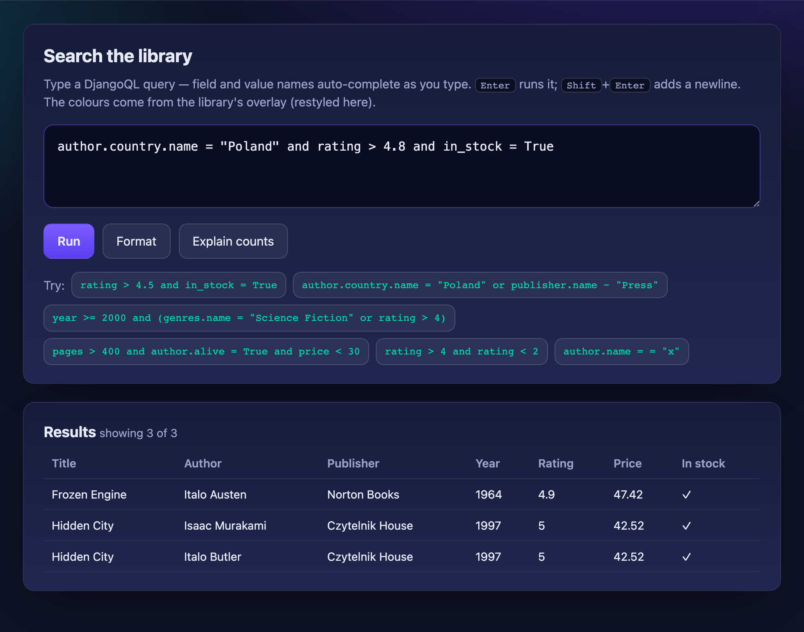
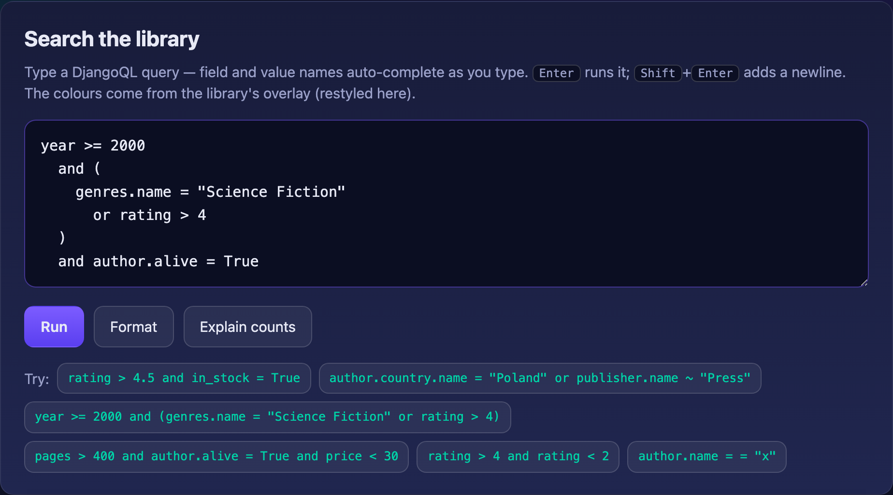
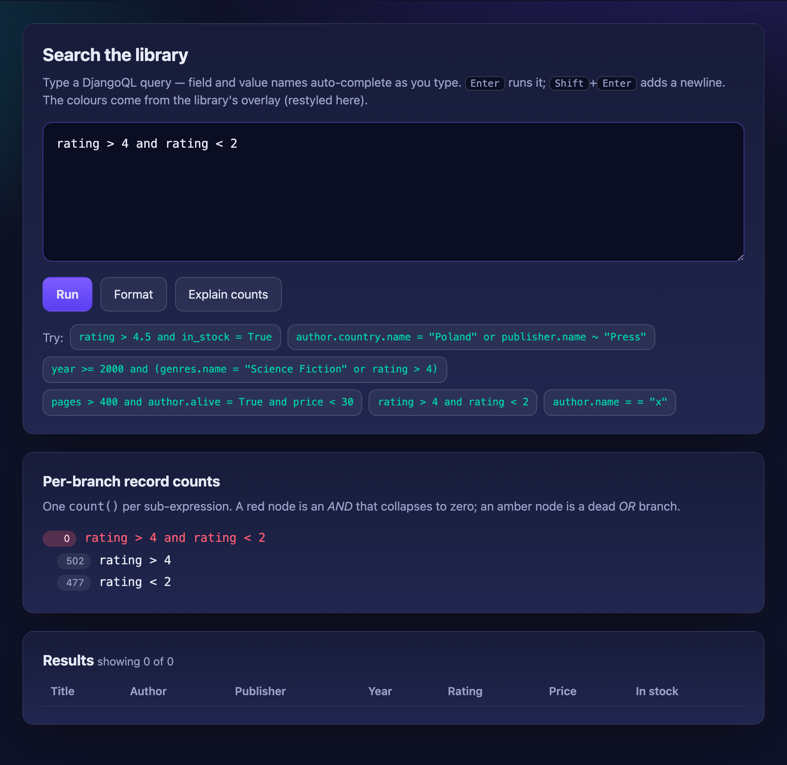
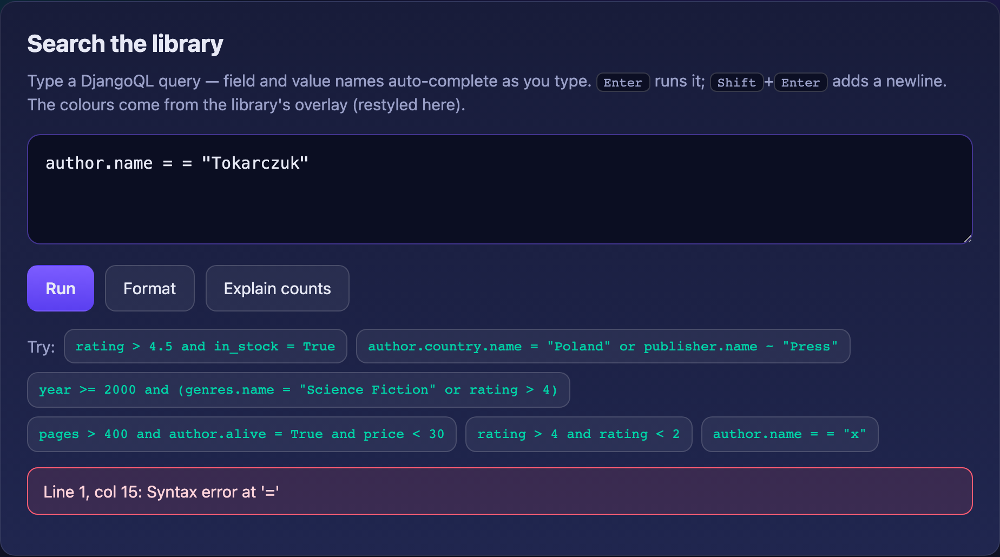

# DjangoQL

[](https://github.com/iplweb/djangoql-iplweb/actions/workflows/tests.yaml)
[](https://pypi.org/project/djangoql-iplweb/)
[](https://github.com/iplweb/djangoql-iplweb)
[](https://github.com/iplweb/djangoql-iplweb)
[](LICENSE)

Advanced search language for Django, with auto-completion. Supports logical operators, parenthesis, table joins, and works with any Django model. Tested on Python 3.10–3.14, Django 5.2 and 6.0. The auto-completion feature has been tested in Chrome, Firefox, Safari, IE9+.

> **This is a community fork.** `djangoql-iplweb` is a fork of the original
> [**DjangoQL** by ivelum](https://github.com/ivelum/djangoql) — install the
> upstream package from [`djangoql` on PyPI](https://pypi.org/project/djangoql/).
> This fork adds internationalization (i18n) of error messages and modernized
> packaging/tooling.
>
> These changes are offered back to the upstream project. **If the original
> maintainers merge them, please switch back to the upstream
> [`djangoql`](https://pypi.org/project/djangoql/) package** — this fork exists
> only to make the improvements available in the meantime, and will defer to
> upstream once they land there.
>
> It is published on PyPI as **`djangoql-iplweb`**, but the import name stays
> `djangoql` (so `INSTALLED_APPS` and `import djangoql` are unchanged).

See a video: [DjangoQL demo](https://youtu.be/oKVff4dHZB8)


## Features

- Python-like query syntax: logical operators (`and`, `or`), parenthesis, and the full set of comparison operators
- Searches across model relations via joins, e.g. `author.last_name = "Tolstoy"`
- Works with any Django model and drops into the Django admin with a single mixin
- Live auto-completion of model field names and values in the admin
- Configurable schema to restrict searchable models/fields and provide suggestion options
- Custom search fields for annotations and fully custom search logic
- Internationalized error messages with translation catalogs for 11 locales
- Usable outside the Django admin, including a standalone JavaScript completion widget
- **Multi-line queries** — `Shift+Enter` inserts a newline (`Enter` still submits)
- **Pretty-print / formatting** — re-indent a query via `format_query()` or the `…/format/` endpoint
- **Per-branch record counts** — see how many rows each sub-expression matches via `explain()` or the `…/explain/` endpoint
- **Syntax highlighting** — a tokenizer (`DjangoQLHighlight.tokenize`) plus a lightweight, restyleable overlay; no palette or editor imposed

## Installation

Using [uv](https://docs.astral.sh/uv/) (recommended):

``` shell
$ uv add djangoql-iplweb
```

Using pip:

``` shell
$ pip install djangoql-iplweb
```

Add `'djangoql'` to `INSTALLED_APPS` in your `settings.py`:

``` python
INSTALLED_APPS = [
    ...
    'djangoql',
    ...
]
```

For full setup instructions and usage examples, see the [Documentation](#documentation) below.

## Documentation

📖 **Full documentation: https://iplweb.github.io/djangoql-iplweb/**

The site is built with MkDocs from the [`docs/`](docs/) directory. Key pages:

- [Installation](https://iplweb.github.io/djangoql-iplweb/installation/) — complete setup guide
- [Django admin integration](https://iplweb.github.io/djangoql-iplweb/admin/) — `DjangoQLSearchMixin` and admin search modes
- [Language reference](https://iplweb.github.io/djangoql-iplweb/language/) — query syntax, operators, and examples
- [Schema & custom fields](https://iplweb.github.io/djangoql-iplweb/schema/) — restrict searchable models/fields, custom search fields
- [Derived fields](https://iplweb.github.io/djangoql-iplweb/derived-fields/) — date/time parts, relation aggregates, custom search logic
- [Outside the admin](https://iplweb.github.io/djangoql-iplweb/queryset/) — `DjangoQLQuerySet` and `apply_search()`
- [Multi-line queries](https://iplweb.github.io/djangoql-iplweb/multiline-queries/) — `Shift+Enter` newline support
- [Pretty-print / formatting](https://iplweb.github.io/djangoql-iplweb/pretty-print/) — `format_query()` and the format endpoint
- [Query breakdown (counts)](https://iplweb.github.io/djangoql-iplweb/query-breakdown/) — per-branch record counts with `explain()`
- [Syntax highlighting](https://iplweb.github.io/djangoql-iplweb/syntax-highlighting/) — tokenizer + overlay, bring-your-own colours/editor
- [Completion widget](https://iplweb.github.io/djangoql-iplweb/completion-widget/) — standalone JS widget outside the admin
- [Example project](https://iplweb.github.io/djangoql-iplweb/example-project/) — runnable demo of all of the above
- [Internationalization](https://iplweb.github.io/djangoql-iplweb/i18n/) — i18n support and supplied locales

## Example project

A runnable demo of all the features above (on a richly related dataset) lives in
[`example_project/`](example_project/). See its
[README](example_project/README.md) for details. Quick start:

``` shell
cd example_project
uv run python manage.py migrate
uv run python manage.py seed_demo          # lots of related demo data
uv run python manage.py createsuperuser    # optional, for the admin
uv run python manage.py runserver
```

Then open <http://127.0.0.1:8000/> (search demo — auto-completion, multi-line,
highlighting, Format, Explain counts) or <http://127.0.0.1:8000/admin/> (admin
with completion + multi-line + the highlight overlay).

### What it looks like

Running a query — live syntax highlighting and results:



The **Format** button re-indents a query (syntax highlighting throughout):



**Explain counts** breaks an empty result down per sub-expression, so you can see
*where* the data runs out — here each side matches ~500 rows but their `and`
matches none:



Syntax errors are pinpointed in the query box:



## Supported by

This fork is graciously supported and maintained by **[iplweb](https://www.iplweb.pl/)**.

<a href="https://www.iplweb.pl/"></a>

## License

MIT
